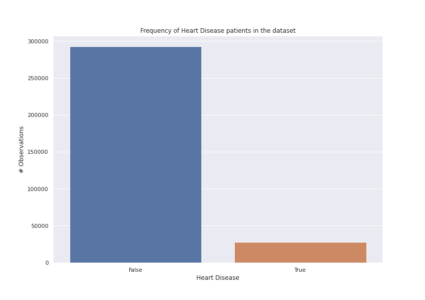
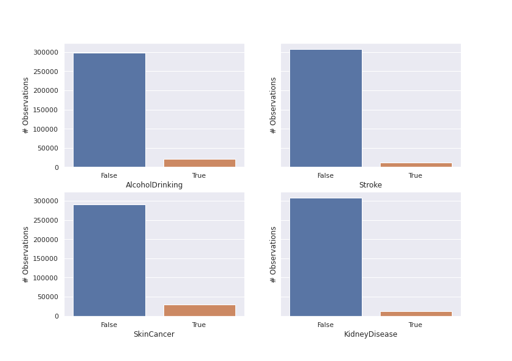
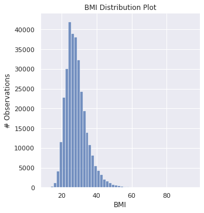

# A Study of SHAP and LIME, comparisons and limitations in two datasets

- [A Study of SHAP and LIME, comparisons and limitations in two datasets](#a-study-of-shap-and-lime-comparisons-and-limitations-in-two-datasets)
  - [Abstract](#abstract)
  - [What is LIME?](#what-is-lime)
  - [What is SHAP?](#what-is-shap)
    - [Questions](#questions)
    - [SHAP Paper](#shap-paper)
    - [Additive Feature Attribution Methods](#additive-feature-attribution-methods)
      - [Definition 1: **Additive feature attribution methods**](#definition-1-additive-feature-attribution-methods)
      - [LIME](#lime)
      - [DeepLIFT](#deeplift)
      - [Layer-Wise Relevance Propagation](#layer-wise-relevance-propagation)
      - [Classic Shapley Value Estimation](#classic-shapley-value-estimation)
        - [Shapley regression values](#shapley-regression-values)
  - [Introduction](#introduction)
  - [Problem definition](#problem-definition)
  - [Challenges](#challenges)
  - [Preprocessing](#preprocessing)
    - [Dataset (1) - Heart Dataset](#dataset-1---heart-dataset)
  - [Processing](#processing)
    - [Dataset (1) - Imbalanced Data](#dataset-1---imbalanced-data)
  - [Results](#results)
  - [References](#references)

## Abstract

## What is LIME?

## What is SHAP?

SHAP assigns each feature an importance value for a particular prediction.  

Novel components

- Identification of a new class of additive feature importance measures  
- theoretical results showing there is a unique solution in this class with a set of desirable properties.

This set of desirable properties is missing in recent proposals.  

### Questions

What is the set of desirable properties?

How does this mapping function works?

What is going to be $g(z')$ in definition 1?

- Cooperative game theory equations
  - classic equations
  - Shapley regression values
  - Shapley sampling values
  - quantitative input influence

### SHAP Paper  

Interpretation of prediction model's output garners user trust, provides insight into how the model may be improved, and helps understanding of the process being modeled. Sometimes, model engineering gravitates towards simpler models with more interpretability in a trade-off for more complex models with more accuracy.  

Findings:  

1. Any explanation of a model's prediction as a model itself. (*explanation model*) Six current methods unified which the authors defined as *additive feature attribution methods* (Section 2)
2. Garantee of a unique solution, coming from game theory, in the class of additive feature attribution methods (Section 3), and SHAP *values* as the unified measure of importance for those 6 methods approximations.  
3. SHAP value estimation methods are better aligned with human intuition, and effectually discriminate model output classes. (Section 5)

### Additive Feature Attribution Methods

We must create a simpler *explanation model* for more complex models, which is defined as an interpretable approximation of the original model. Six current explanation methods from literature use the same *explanation model*, and this unity of all them has not been appreciated.

------

Local methods

- Let $f$ be the original prediction model.
- Let $g$ be the explanation model.
- LIME: Explanation of prediction $f(x)$ based on single input $x$

Often, explanation models:  

- *Simplified inputs* $x{'}$, map original input through mapping function $x = h_{x}(x')$
- Local methods, $g(z') \approx f(h_{x}(z'))$, whenever $z' \approx x'$
- Note: $h_{x}$ is specific to current input $x$
- Note: So $h_{x}(x') = x$, even though $x'$ contains less info than $x$

#### Definition 1: **Additive feature attribution methods**  

Linear function of **binary variables**  

- $z' \in \{0, 1\}^{M}$ (either 0 or 1)
- $M$ is the the number of simplified input features
- $\phi_{i} \in \mathbb{R}$ (any number)

$$ g(z') = \phi + \sum_{i=1}^{M} \phi_{i}z'_{i} $$
(Equation 1)

So, it's $\phi_{0}$ + the weight of each $\phi$, if the feature $z'_{i}$ is present in the simplified features. (1 -> Present, 0 -> Not Present). $g(z')$ is the *explanation model*

#### LIME

The LIME method interprets individual model predictions based on locally approximating the model around a given prediction.

- simplified inputs $x'$ as "interpretable inputs"
- Mapping $x = h_{x}(x')$ converts binary vector of "interpretable inputs" into original input space.
- Different types of $x = h_{x}(x')$ for different input spaces.

Objective function:
$$\xi = \underset{g \in \varrho}{arg min} L(f, g, \pi_{x'} + \Omega(g)$$  
(Equation 2)

- Faithfulness (Approximation to) of the **explanation model** $g(z')$ to the **original model** $f(h_{x}(z'))$ is enforced through the loss $L$ (Squared Loss) over a set of samples in the *simplified input space* $(x')$
- Weighted by the local kernel $\pi_{x'}$.
- $\Omega$ penalizes the complexity of g.
- Equation 2 can be solved using penalized linear regression.

#### DeepLIFT

Recursive prediction explanation method for deep learning.  
Input $x_i$ has a value $C_{\Delta x_i \Delta y}$ that is equal to effect of that input being set to a **reference value**. (Default value)  
The mapping $x = h_{x}(x')$ converts binary values into the original inputs. 1 -> Input takes original value, 0 -> Input takes reference value.
> The reference value, though chosen by the user, represents a typical uninformative background value for the feature.

"summation-to-delta" property that states:  
$$\sum_{i=1}^{n} C_{\Delta x_i \Delta o} = \Delta_O$$
(Equation 3)

- $o = f(x)$ --> Model Output
- $\Delta_O = f(x) - f(r)$
- $\Delta x_i = x_i - r_i$
- r --> Referenee input

If then:

- $\phi_i = C_{\Delta x_i \Delta o}$  
- $\phi_0 = f(r)$

We get equation (1) again, making DeepLIFT another additive feature attribution method.

#### Layer-Wise Relevance Propagation

> This method is equivalent to DeepLIFT with the reference activations of all neurons fixed to zero. [!] COPY-PASTED

We can see it as a special case of DeepLIFT. The equation also matches equation (1)

#### Classic Shapley Value Estimation

There are three methods that use classic equations from cooperative game thoory to compute explanatations of model predictions:  

- ShaPley regression values
- Shapley sampling values
- Quantitative Input Influence

##### Shapley regression values

- $F$ is the set of all fetures.
- Retraining of the model on all feature subsets $S \subseteq F$
- Model $f_{S \cup \{i\}}$ trained with feature present; Model $f_S$ with feature withheld;
- Compare models on current input $f_{S \cup \{i\}}(x_{S \cup \{i\}}) - f_{S} (x_S)$; $x_S$ are the values of the input features in the set $S$
- Effect of withholding a feature is calculated.
- The preciding differences are computed for all possible subsets $S \subseteq F / \{i\}$

They are a weighted average of all possible differences:  

## Introduction

This project consists in making a study of the available model explanation tools that are currently being used the most. Namely, SHAP [\[1\]](#SHAP-ref-1) and LIME [\[2\]](#LIME-ref-1). This topic interested us bacause nowadays, with a booming of Machine Learning and complex, black-box models, it's difficult to trust models that aren't transparent and fully understood, even more when they pilot critical decisions [\[3\]](#why-explainable-ai-ref-1) in varios aspects of our lives and businesses. We decided to setup an experiment to evaluate the contrast between the two mentioned tools.  
The project was run on a conda environment with ... [!]

## Problem definition

Another question we tried to answer was if adding or removing a low importance feature impacted the importance of other features in a significant way.  

> <<((Maneira interessante de adicionar estatística aqui no meio, possivelmente vai dar para comparar os resultados de um antes e depois, e se a diferença der uma distribuição é porque tem impacto, se a diferença der um gráfico aleatorio, então é porque não tem impacto. Deve ser mais ou menos isto. É possível adicionar testes de hipoteses aqui no meio, o que seria mel.))  

Se a questão anterior for que não há diferenças significativas:
One other question we tried to answer was if we train the model with two highly correlated features, something that didn't happen in normal circumstances, will it impact the previosly present feature importance?

## Challenges  

## Preprocessing

This section is caracterized by the initial cleaning of data. Over the two datasets, we wiped the rows that had missing values, corrected the type of feature, e.g. from float to int, including the usage of OneHot Encoding for categorical features. In the end we also looked at the distributions of all features, on the lookout for outlier candidates. Finally, we looked at the correlations between features, so take some *a priori* notes on multicollinearity.

### Dataset (1) - Heart Dataset

We started analysing this dataset by looking at the missing values. What we found was that there were none. All features were clean in this regard. No action was performed here.  
The column types were not optimal, as most features were encoded as strings of `Yes`/`No`. `GenHealth` was [!]scalar (`Poor` to `Excellent`), and encoded as string. `Gender` was a string of `Female`/`Male`.
Other features like `Diabetic` and `Race` are completely categoric.  
We decided to turn the `Yes`/`No` features into `boolean`, `GenHealth` into a sequence of integers from `1` to `5`, `Gender` into `0`/`1`, and to the purely categorical features, we applied the `OneHotEncoder` implementation from `sklearn`.  
The distributions of target feature was the following  

<tag id="fig-h-pre-target-count">Plot 1</tag> - The frequency of Heart Disease patients. Here we can denote an unbalance in the dataset. With this in mind, we decided to experiment with over and under sampling techniques further ahead.

Four of the features also displayed an imbalance on the data, being them `AlcoholDrinking`, `Stroke`, `KidneyDisease` and `SkinCancer`, all with only 10% of the observations being `True`.  

<tag id="fig-h-pre-target-count">Plot 2</tag> - The frequency of the four mentioned features. Each has less than 10% of True observations. [!]

One last feature that we think needs attention is the `BMI`. Because it's the only true continuous feature in our dataset. It's [graph]() shows a possibility of outlier candidates, which we will treat in the processing phase. 

<tag id="fig-h-pre-bmi-outliers">Plot 3</tag> - This distribution shows a tail after BMI with the value of 60. It has around 500 observations after this value.

## Processing

### Dataset (1) - Imbalanced Data

In our Dataset 1 (Heart Diseases), as mentioned before, [the target class is imbalanced](#fig-h-pre-bmi-outliers)). We tried to attenuate this imbalance by using a combination of the SMOTE (Synthetic Minority Over-sampling Technique) [\[5\]](#smote-ref-1) technique for over-sampling and the Tomek links [\[6\]](#tomeklinks-ref-1) technique for down-sampling. SMOTE has been proven to be effective in literature. [\[4\]](#smote-effective-literature-ref-1),[\[7\]](#smote-effective-literature-ref-2)  
We used the implementation in the *imblearn* library, by creating first the *SMOTE* and the *TomekLinks* Objects first, both with the parameter *n_jobs=-1*, for it to use all CPU cores available. Then we created the *SMOTETomek* object, also with *n_jobs=-1*. It had to be done this way, because the implementation is not optimized for a high volume of data, and it was both cpu-demanding and time-consuming (Over 3 hours) to obtain the results, even for a dataset with only ~350.000 observations.  
The resulting dataset from this process

## Results

## References

[1] <a id="SHAP-ref-1" href="https://proceedings.neurips.cc/paper/2017/hash/8a20a8621978632d76c43dfd28b67767-Abstract.html">Lundberg, Scott M., and Su-In Lee. "A unified approach to interpreting model predictions." Advances in neural information processing systems 30 (2017)</a>

[2] <a id="LIME-ref-1" href="https://dl.acm.org/doi/abs/10.1145/2939672.2939778">Ribeiro, Marco Tulio, Sameer Singh, and Carlos Guestrin. "" Why should i trust you?" Explaining the predictions of any classifier." Proceedings of the 22nd ACM SIGKDD international conference on knowledge discovery and data mining. 2016.</a>

[3] <a id="why-explainable-ai-ref-1" href="https://cloud.google.com/blog/products/ai-machine-learning/why-you-need-to-explain-machine-learning-models">“Why You Need to Explain Machine Learning Models | Google Cloud Blog.” Google</a>

[4] <a id="smote-effective-literature-ref-1" href="https://link.springer.com/article/10.1007/s10916-014-0050-0">Karabulut, Esra Mahsereci, and Turgay Ibrikci. \"Effective automated prediction of vertebral column pathologies based on logistic model tree with SMOTE preprocessing.\" Journal of medical systems 38.5 (2014): 1-9.</a>

[5] <a id="smote-ref-1" href="https://link.springer.com/article/10.1007/s10916-014-0050-0">Chawla, Nitesh V., et al. \"SMOTE: synthetic minority over-sampling technique.\" Journal of artificial intelligence research 16 (2002): 321-357.</a>

[6] <a id="tomeklinks-ref-1" href="https://cir.nii.ac.jp/crid/1570009751555535232">Tomek, Ivan. \"Two modifications of CNN.\" IEEE Trans. Systems, Man and Cybernetics 6 (1976): 769-772.</a>

[7] <a id="smote-effective-literature-ref-2" href="https://www.inf.ufrgs.br/maslab/pergamus/pubs/balancing-training-data-for.pdf"> Batista, Gustavo EAPA, Ana LC Bazzan, and Maria Carolina Monard. "Balancing Training Data for Automated Annotation of Keywords: a Case Study." WOB. 2003.</a>
